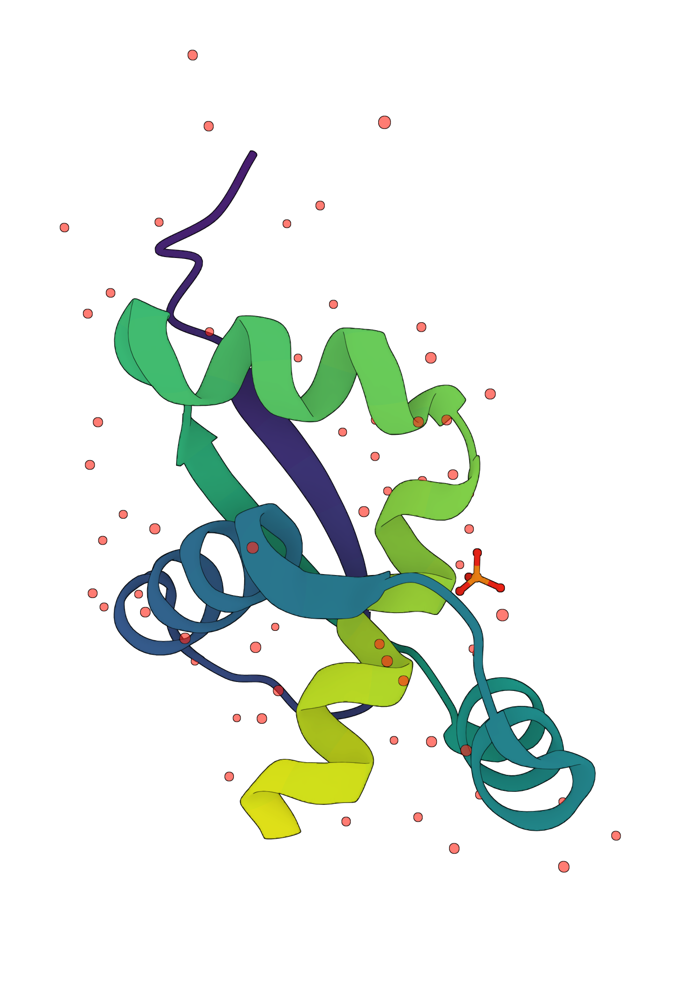

# HardProteins

Potential hard targets for protein structure prediction tasks.

## Lists

### P21359-2: human neurofibromin isoform 2

> Naschberger, A., Baradaran, R., Rupp, B., & Carroni, M. (2021). The structure of neurofibromin isoform 2 reveals different functional states. Nature, 599(7884), 315–319. <https://doi.org/10.1038/s41586-021-04024-x>

* closed conformation
  * 7pgr
  * ...
* opened conformation
  * 7pgt
  * ...

view

### P04156: human major prion protein

* (23-230)
  * 1qlx
  * ...
* fibril (94–178)
  * 6uur

view

<table>
  <tr>
    <td>
      
    </td>
    <td>
      
    </td>
    <td>
      
    </td>
  </tr>
  <tr>
    <td>
      1qlx.A
    </td>
    <td>
      6uur.A
    </td>
    <td>
     6uur
    </td>
  </tr>
</table>

### a hypothetical protein (MJ0366) from Methanocaldococcus jannaschii revealed a novel topological arrangement of the knot fold

> Thiruselvam, V., Kumarevel, T., Karthe, P., Kuramitsu, S., Yokoyama, S., & Ponnuswamy, M. N. (2017). Crystal structure analysis of a hypothetical protein (MJ0366) from Methanocaldococcus jannaschii revealed a novel topological arrangement of the knot fold. Biochemical and biophysical research communications, 482(2), 264–269. <https://doi.org/10.1016/j.bbrc.2016.11.052>

* 2efv

view

